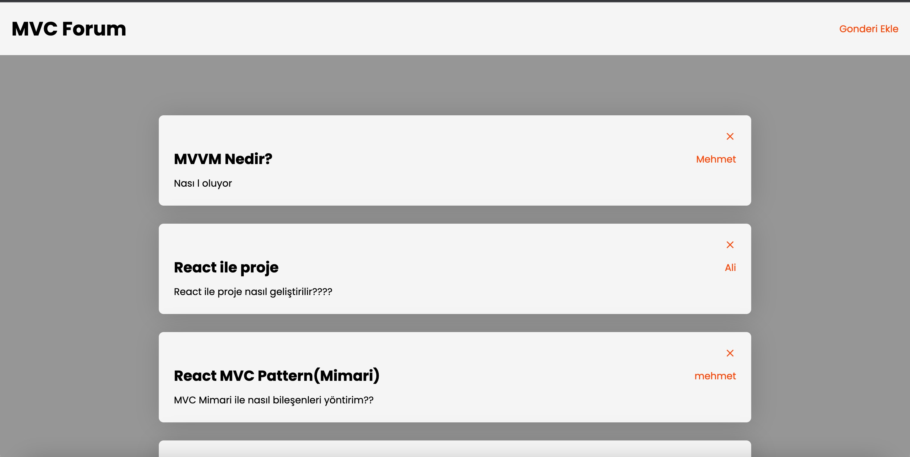

## 🌐 Forum Uygulaması

Bu proje, React kullanarak oluşturulmuş basit bir forum uygulamasını içerir. Kullanıcılar foruma kaydolabilir, yeni konular oluşturabilir, mevcut konulara yanıtlar ekleyebilir ve forumdaki diğer konuları görüntüleyebilirler.

## Kullanım

- Yeni bir konu oluşturmak için "Forum Kismina" gerekli bilgileri girin.
- Mevcut konuları görüntülemek için ana sayfada bulunan konu listesini kullanabilirsiniz.
- Bir konuya tıkladığınızda, konunun detaylarına ve bu konuya yapılan yanıtlara erişebilirsiniz.

## Ekran Goruntusu

 
